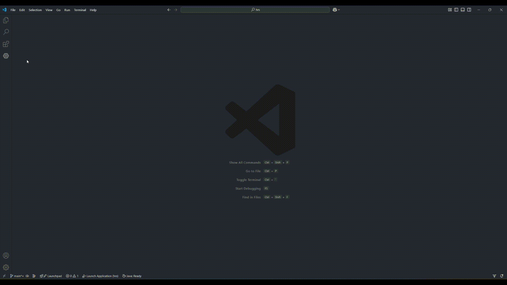

## Description

**HRS (pronounced "Hours")** is a modern full-stack starter kit designed for rapid development with Java, Spring Boot, Hilla (Vaadin), React, and Shadcn UI. It provides a well-structured foundation to build scalable, reactive, and beautifully designed web applications efficiently.

### 🚀 Why HRS?

**Full-Stack Efficiency** – Seamless integration of Java backend with a modern React frontend.

**Type-Safe by Default** – End-to-end type safety with Hilla for a smooth development experience.

**Shadcn UI** – Pre-built, customizable UI components for rapid UI development.

**Spring Boot** – A battle-tested backend framework with powerful capabilities.

**Developer** Experience (DX) – Because programming should be fun

### 🏗 Tech Stack

**Backend** – Java, Spring Boot, Hilla (Vaadin)

**Frontend** – React, TypeScript, Vite

**UI** – Shadcn (Radix UI + Tailwind CSS)

### 📦 Features

✔️ Pre-configured authentication & authorization

✔️ API-first approach with type-safe endpoints

✔️ Reactive UI powered by Hilla & React

✔️ Ready-to-use UI components with Shadcn

✔️ Environment-based configurations

✔️ Best practices for maintainable and scalable code

## Getting Started

### Prerequisites

-   A Windows machine
-   Visual Studio Code

### Installation

0. Clone the repository

    ```bash
    git clone https://github.com/ludovikallen/hrs-starter.git
    cd hrs-starter
    ```

1. Run the dependancies installation script as an administrator with Powershell and start the docker containers

    ```bash
    cd local
    .\install-deps.ps1
    docker-compose up
    ```

2. Open the pgadmin4 in your browser and login with the following credentials:

    ```
    URL: http://localhost:2346
    Email: admin@admin.com
    Password: postgres
    ```

3. Login to the server with the following credentials:

    ```
    Name: local
    Host: pg_container_hrs
    Port: 2345
    Username: postgres
    Password: postgres
    ```

4. Run or debug the application with hot reload. 

    - You can run or debug the application using the Spring Boot Dashboard VSCode extension and the local profile.
    - You can now open the app on http://localhost:8888 in your browser.

## Roadmap

✅ Add basic template with email and password authentication

✅ Add Windows and VSCode local environment script

✅ Add Github Actions to run on PR

⏳ Add database migration engine

⏳ Add basic deployment guide using Coolify with a pull request preview environment

⏳ Add rate limiting

## Troubleshooting

### Common Problems

## Project etiquette

0. Contributors needs to open a pull request to push code to main.
1. All accepted code must comply to both the frontend and backend linter rules.
